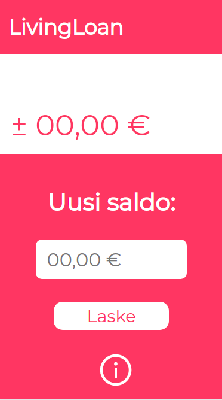

<h1> Living Loan </h1>

<h2>Overall aim</h2>

 !!! The app is "usable" only in mobile browser at the moment. !!!

 Web app that does student loan calculation.
 

The app can be found at: 

<a>http://livingloan.herokuapp.com/</a> 

<h2>Quick Facts</h2>

- Uses React.JS as it's front end.
- Uses Python's Flask to run API that does the calculations.
- App doesn't store any of the numbers the user puts in it.
- After the web app version is complete, the next step would be to port it on to React Native.
- The Web app is at the moment really only made for the mobile browser. It is usable in desktop browser too but it is horrible to look at.

<h2>Project Statement</h2>

The aim of this project is to make it easier for stundets to keep track of their student loan. It is known that the basic student loans that banks give to students are about 650 euros per month. From that it's not really hard to calculate the sum you have left for the month but it sure is more convinient to just type the current budget into the app and see the answer.

All in all that's the basic jist of the app. It's not about being complicate or flashy but more being just convinient. 

<h2>Preview</h2>

<h2>To Do List</h2>

- [x] Create logo
- [ ] Improve logo
- [ ] Create browser hyper link images
- [ ] Improve README.md (This file)
- [ ] Clean up the project files
- [ ] Format the code properly
- [ ] Add more TODOs
- [x] Survive from school assignments
- [ ] Make the app usable on desktop browser
- [ ] Design GUI for desktop browser

  

